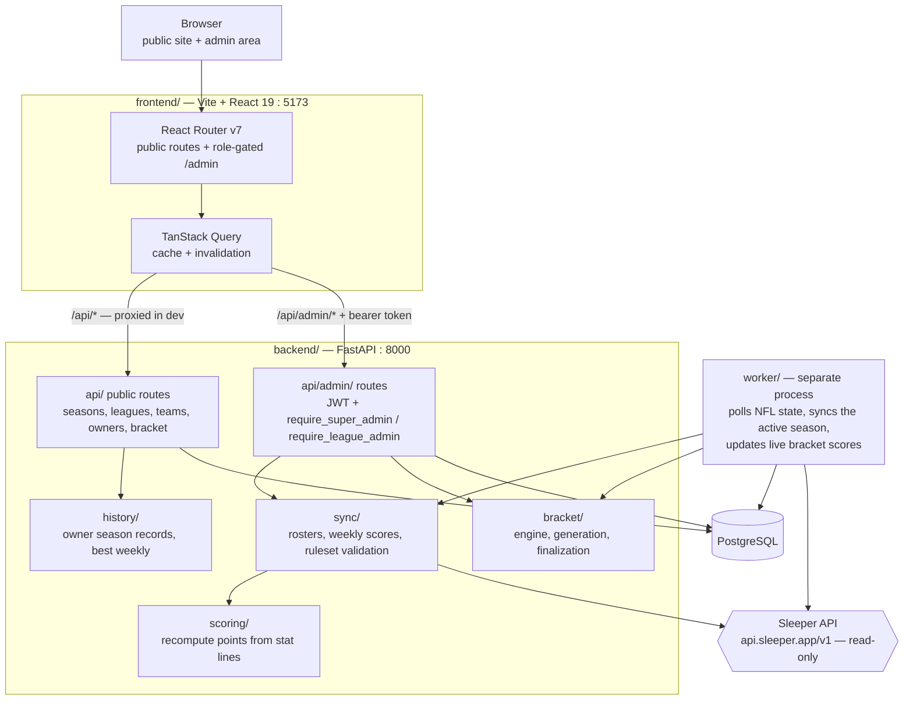

# Insight2Redraft

A cross-league fantasy-football companion for a group of Sleeper leagues. It pulls
each league's rosters and weekly scores from Sleeper, unifies owners across leagues
and seasons, and runs a **site-wide "super-bracket"** playoff between the qualifiers
from every member league.

- **Public site** — season dashboard, league standings, team pages, owner profiles.
- **Admin area** — login-gated and role-aware: seasons and leagues, owner records and
  per-team mapping, league-admin accounts and grants, and the super-bracket.

Two services run locally: a **FastAPI backend** (`backend/`, port 8000) and a **Vite +
React frontend** (`frontend/`, port 5173). The frontend proxies `/api/*` to the backend.

---

## Running it locally

**Full setup instructions live in [`docs/local-dev.md`](docs/local-dev.md)** — prerequisites,
Postgres via Docker, migrations, env files, the sync worker, and the WSL hot-reload
caveat. Start there on a fresh machine.

Once set up, the day-to-day loop is two terminals:

```bash
# terminal 1 — backend (from backend/)
uv run uvicorn app.main:app --reload

# terminal 2 — frontend (from frontend/)
npm run dev
```

Then open <http://localhost:5173>.

---

## Getting to something worth looking at

A fresh database renders empty states everywhere. To see the app with real data:

### 1. Create a super-admin to log in with

```bash
# from backend/
uv run python -m app.cli create-superadmin --email you@example.com --password 'a-long-password'
```

Re-running with the same email **resets that account's password** and re-promotes it to
super-admin — handy if you lock yourself out. Then sign in at <http://localhost:5173/login>.

### 2. Build a season through the admin UI

Everything below is doable in the browser — no `curl` needed. Work in this order,
because each step depends on the one before it:

| Step | Where | What it does |
|---|---|---|
| 1 | `/admin/seasons` → **New season** | Create the year, playoff field size, and NFL playoff weeks |
| 2 | Season detail → **Add league** | Enter a **Sleeper league ID**; pulls rosters and validates scoring |
| 3 | League row → **Map owners** | Attach an owner record to each Sleeper roster |
| 4 | `/admin/owners` | Create/edit owner identities (these unify a person across leagues) |
| 5 | League row → **Sync now** | Pull current weekly scores |
| 6 | Season detail → **Manage bracket** | Generate the super-bracket, review the draft, approve, then finalize each round |

The **Sleeper league ID** is the id Sleeper itself uses for the league — the long
numeric segment in the league's URL in the Sleeper web app, and the same id the
Sleeper API takes (`https://api.sleeper.app/v1/league/<id>`). The league must already
exist in Sleeper: the app reads from it, it never creates leagues.

Note that **bracket generation requires the season's status to be `playoffs`**; the
Generate button stays disabled otherwise, and you set status on the season form.

### 3. Live scores (optional)

Weekly score syncing and live bracket scores come from a separate worker process. The
app is fully browsable without it — start it only when you want data to move:

```bash
# from backend/
uv run python -m app.worker
```

---

## Roles

- **super-admin** — everything, including accounts, grants, and the bracket.
- **league-admin** — read the admin area and run **Sync now** on granted leagues.

Create league-admin accounts and grant them leagues at `/admin/accounts`. The seeded
account from the CLI above is always a super-admin.

---

## Tests and checks

```bash
# frontend (from frontend/) — no backend or database needed, uses MSW mocks
npm test
npm run build          # tsc + vite build
npm run lint

# backend (from backend/) — needs Postgres running
uv run pytest -v
```

### If the backend suite explodes with `connection refused`

Every backend test is database-backed, so a stopped Postgres makes the **entire** suite
error at once. That looks alarming but is environmental. Check first:

```bash
ss -ltn | grep 5432          # anything listening?
docker ps -a | grep postgres # container merely stopped?
docker start <container>     # e.g. i2r-pg
```

Also note `tests/test_migrations.py` shells out to Alembic against the **main** database
(`insight2redraft`), not the test database — so those three tests fail if you created
only `insight2redraft_test`. See `docs/local-dev.md` for creating both.

---

## Architecture

Three moving parts talk to one Postgres database. Sleeper is the only external
dependency, and it is **read-only** — nothing is ever written back to it.



**Why the worker is separate:** the API serves requests, the worker owns the clock. It
polls Sleeper for the current NFL week, and if a season for that year exists and is not
idle, it syncs that season's leagues and refreshes live bracket scores. Nothing in the
request path waits on Sleeper, so the site stays responsive when Sleeper is slow — and
the app is fully browsable with the worker stopped, just with static data.

**Where the interesting logic lives:**

| Module | Responsibility |
|---|---|
| `backend/app/sync/` | Pull rosters and weekly scores from Sleeper; validate a league's scoring settings against the season ruleset |
| `backend/app/scoring/` | Recompute points from raw stat lines, so a league's scores can be checked rather than trusted |
| `backend/app/bracket/` | `engine` seeds and pairs, `generation` builds the field, `finalization` settles a round and advances winners |
| `backend/app/history/` | Cross-season aggregates behind owner profiles |
| `backend/app/api/admin/` | Every write path; all of it role-gated |
| `frontend/src/features/` | Query/mutation hooks, one module per admin area |
| `frontend/src/pages/admin/` | The admin screens |

## Layout

```
backend/     FastAPI app, SQLAlchemy models, Sleeper sync, bracket engine, worker
frontend/    Vite + React 19 + TypeScript, TanStack Query, Tailwind v4, MSW tests
docs/        local-dev.md, plus design specs and implementation plans
```
